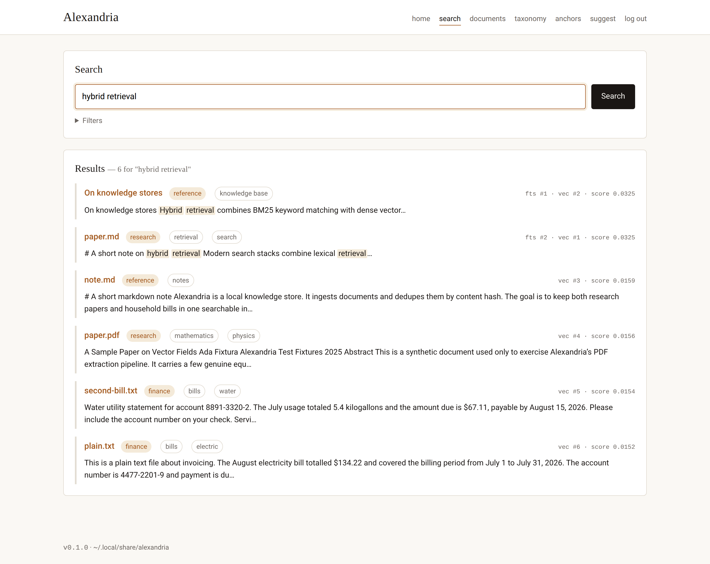
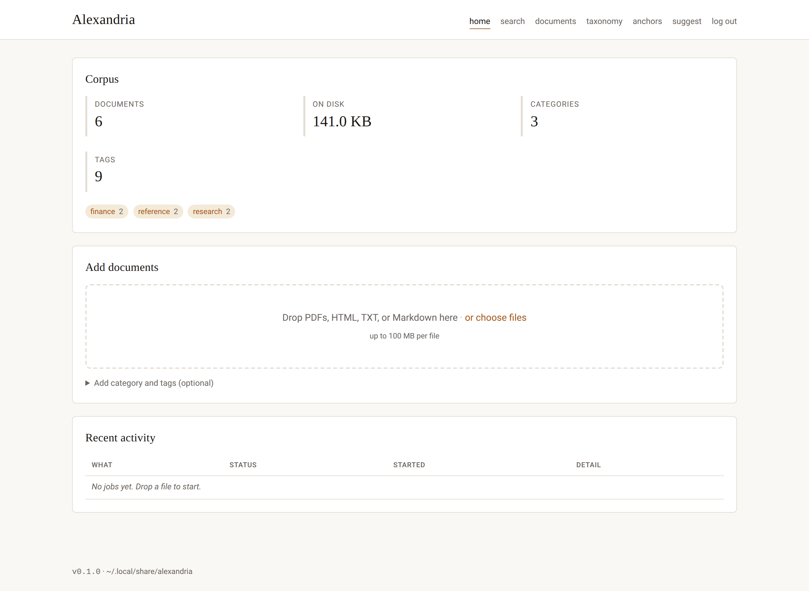
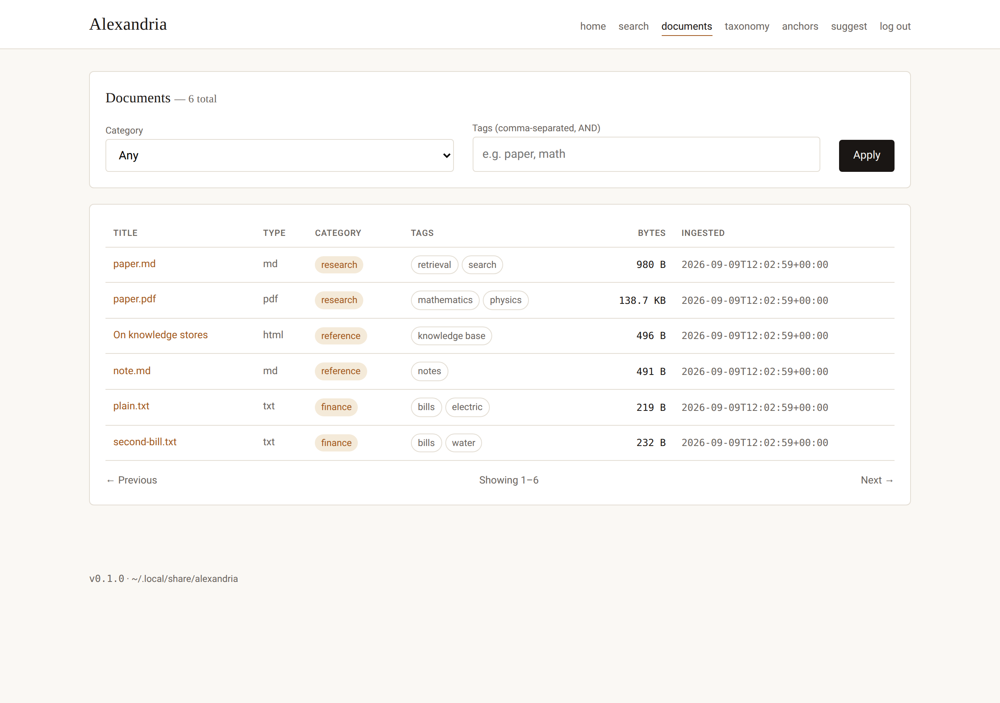
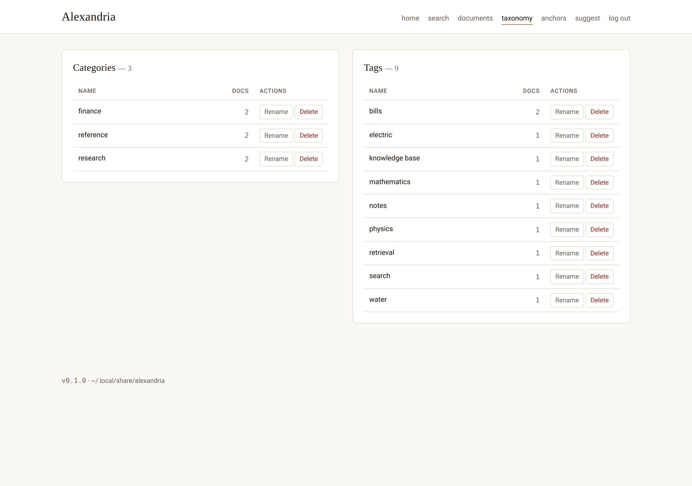
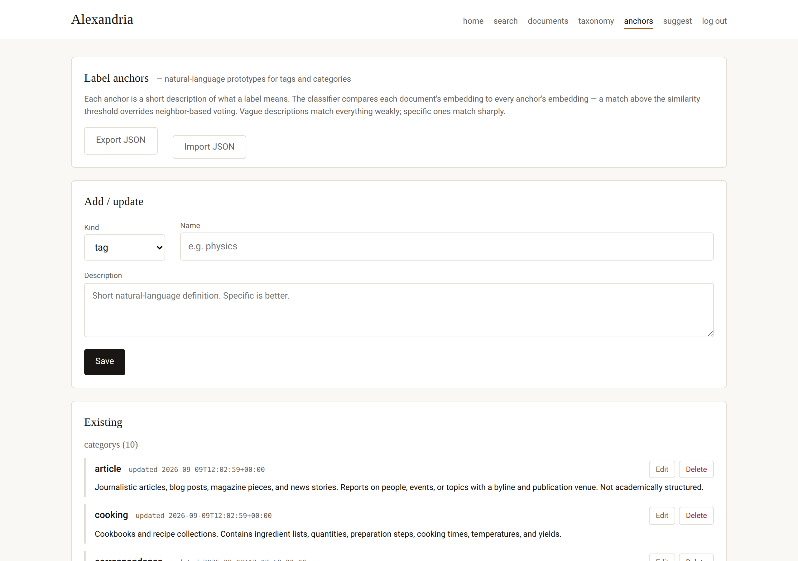

# Alexandria

A local, single-user knowledge store with an MCP interface. Ingests PDFs, HTML,
plain text and markdown from folders or URLs; deduplicates by content hash;
retrieves with hybrid keyword + semantic search. Everything lives in one portable
SQLite file — no external services, no cloud.

It's designed to be driven by an LLM agent as readily as by a person: the same
tool surface is exposed over MCP (stdio for local clients, Streamable HTTP for
remote ones) and a browser UI, all against one corpus.

**Highlights**

- **Hybrid retrieval** — BM25 (SQLite FTS5) fused with vector search (sqlite-vec) via reciprocal rank fusion.
- **Content-addressed dedup** — three cheap layers collapse the same document across renamed files, re-downloads, and format conversions.
- **Mixed corpora** — research papers and household bills coexist in one index; categories and tags keep them from crowding each other out.
- **Zero-shot labelling** — user-authored category/tag "anchors" let a classifier suggest metadata for new documents, with no training step.
- **Agent-native** — 19 MCP tools spanning ingest, search, curation, and metadata, identical across the stdio and HTTP transports.
- **Portable** — one SQLite DB (metadata + FTS + vectors) plus a content-addressed blob store; back it up by copying a directory.

<p align="center">
  
</p>

See [SPEC.md](SPEC.md) for the full design document.

## How it works

Alexandria is one Python package — ingestion, retrieval, and a catalog — behind a
shared tool surface. That surface is reachable three ways, all co-hosted on one
process and one SQLite file: an MCP **stdio** server, an MCP **Streamable-HTTP**
server, and a **Starlette web UI**.

```
  MCP stdio ─┐
  MCP HTTP  ─┼─▶  ingest · search · catalog  ─▶  SQLite (FTS5 + sqlite-vec) + blobs/
  Web UI    ─┘
```

**Ingestion** turns each file or URL into deduplicated, searchable text:

```
fetch → sniff type → hash raw bytes → extract → normalize → hash text → chunk → embed → index
```

Extraction is per-type (pypdf for PDFs, trafilatura for HTML, UTF-8 for
text/markdown); normalization applies NFKC folding, ligature expansion, and
hyphenated-line-break repair — the biggest searchability win for LaTeX-generated
PDFs. Deduplication runs three layers in order — same source, same raw-byte hash,
same normalized-text hash — so re-downloads, renamed copies, and PDF↔HTML
re-exports of the same content collapse to a single document.

**Retrieval** runs two searches per query and fuses them: BM25 over FTS5 and
cosine nearest-neighbours over sqlite-vec, combined with reciprocal rank fusion
(no score calibration needed), then filtered by category and tags.

**Storage** is a single portable directory: one SQLite database holding metadata,
full text, the keyword index, and the vector index, plus a content-addressed
`blobs/` tree of the original bytes for provenance and re-extraction.

## Install

Requires Python 3.12+ and [uv](https://github.com/astral-sh/uv).

```sh
uv sync
```

The first ingest downloads the embedding model (`BAAI/bge-small-en-v1.5`, ~130 MB)
into your HuggingFace cache.

## Data directory

Alexandria stores everything under `$XDG_DATA_HOME/alexandria/` (falling back to
`~/.local/share/alexandria/`). Override with `ALEXANDRIA_HOME`.

```
$ALEXANDRIA_HOME/
├── alexandria.db     # SQLite with FTS5 + sqlite-vec
├── blobs/            # original bytes, content-addressed by sha256
└── config.toml       # (optional) user overrides
```

## CLI

```sh
# ingest a single file with a category and tags
uv run alexandria ingest ~/Docs/paper.pdf --category research --tags ml,retrieval

# walk a folder (recursive, supported extensions only by default)
uv run alexandria ingest-folder ~/Docs/Bills --category bills --tags 2026

# fetch and ingest a URL; category may come from config.toml rules
uv run alexandria ingest-url https://arxiv.org/abs/2004.04906

# search (hybrid RRF fusion by default)
uv run alexandria search "reciprocal rank fusion" --limit 5
uv run alexandria search "8891-3320-2" --category bills --mode fts
uv run alexandria search "how do dense retrievers work" --mode vec

# browse the corpus
uv run alexandria list --category research
uv run alexandria info
```

## Config (optional)

`$ALEXANDRIA_HOME/config.toml` — everything has sensible defaults; you only need
to override what you care about.

```toml
[embeddings]
model = "BAAI/bge-small-en-v1.5"
device = "cpu"                   # "cpu" | "cuda" | "mps"

[chunking]
tokens = 800
overlap = 100

[storage]
keep_blobs = true                # keep original bytes for provenance

[extractors.pdf]
backend = "pypdf"                # "pypdf" | "marker"
device  = "auto"                 # "auto" | "cuda" | "cpu" | "mps"

[http]
user_agent = "Alexandria/0.1"
respect_robots_txt = true
max_redirects = 5
timeout_seconds = 30

# URL heuristics: applied to ingest-url when the caller doesn't supply a category.
# host_glob uses fnmatch (so *.example.com matches subdomains).
[[category_rules]]
host_glob = "arxiv.org"
category  = "research"
tags      = ["paper"]

[[category_rules]]
host_glob = "*.pge.com"
category  = "bills"
tags      = ["utility", "electric"]
```

## MCP integration

Alexandria exposes its full surface over MCP — 19 tools spanning ingestion
(`ingest_folder_tool`, `ingest_url_tool`), retrieval (`search_tool`,
`get_document_tool`, `list_documents_tool`, `get_catalog_tool`,
`get_original_tool`), curation (`delete_document_tool`, `rename_category_tool`,
`delete_category_tool`, `rename_tag_tool`, `delete_tag_tool`), metadata
suggestions (`suggest_metadata_tool`, `suggest_metadata_bulk_tool`), and label
anchors (`list_anchors_tool`, `set_anchor_tool`, `delete_anchor_tool`,
`import_anchors_tool`, `export_anchors_tool`). The tool surface is identical
across both transports.

### Local (stdio)

For clients on the same machine (Claude Code on your laptop hitting a local
corpus). Add to your MCP client (e.g. `~/.claude/mcp.json`):

```json
{
  "mcpServers": {
    "alexandria": {
      "command": "uv",
      "args": ["run", "--directory", "/path/to/Alexandria", "alexandria", "mcp"]
    }
  }
}
```

### Remote (Streamable HTTP)

For agents on other machines hitting a central corpus (typically the GPU host
running marker). On the server:

```sh
# generate a token once
openssl rand -hex 32 > $ALEXANDRIA_HOME/auth_token && chmod 600 $ALEXANDRIA_HOME/auth_token

# start the server, exposed on the LAN
uv run alexandria mcp-http --host 0.0.0.0 --port 8765 \
    --auth-token-file $ALEXANDRIA_HOME/auth_token
```

Token resolution order: `ALEXANDRIA_AUTH_TOKEN` env var > `--auth-token-file`
flag > `[network] auth_token_file` in `config.toml`. Missing token when
binding a non-loopback host aborts startup — pass `--no-auth` for
trusted-network deploys (Tailscale, WireGuard, LAN behind a firewall).

On the client:

```json
{
  "mcpServers": {
    "alexandria-remote": {
      "url": "https://alexandria.example.com/mcp",
      "headers": {
        "Authorization": "Bearer <paste-token>"
      }
    }
  }
}
```

**TLS is out of scope for the app** — terminate at a reverse proxy. Sample
Caddy config:

```
alexandria.example.com {
    reverse_proxy 127.0.0.1:8765
}
```

Or expose only inside a mesh network (Tailscale/WireGuard) and skip TLS
altogether — `--no-auth` is reasonable there since the mesh already gates
access.

## Web UI

Alexandria ships with a browser UI that co-hosts on the same ASGI app as
`mcp-http` — one port, one systemd unit, one auth strategy split between two
credentials (the MCP bearer token stays; the web password is separate).



### Enable

The web UI is on by default whenever `alexandria mcp-http` runs. Set a password
before first browser access:

```sh
alexandria set-web-password        # prompts twice; writes chmod-600 bcrypt hash
```

Then visit `http://<host>:8765/` and log in. Nothing further is needed on the
MCP client side — the MCP bearer token and the web password are independent.

### What's there

- **`/`** — landing: catalog totals, drop zone for multi-file upload (PDF /
  HTML / TXT / MD), live activity feed of ingest jobs.
- **`/search`** — hybrid FTS + vector search, filterable by category and tags.
  Hit cards link into the doc detail page. FTS matches are highlighted with
  `<mark>` in the UI and `**…**` in the JSON/MCP API.
- **`/documents`** — filterable, paginated document browser.
- **`/documents/{id}`** — full metadata, sources, tags, and a lazy-loaded
  "Show extracted text" panel.



### Config

```toml
[web]
enabled = true          # set to false to disable page routes entirely
title = "Alexandria"    # shown in header + page title
max_upload_mb = 100     # per-file cap; larger uploads get 413
password_hash_file = ""   # default: $ALEXANDRIA_HOME/web_password_hash
session_secret_file = ""  # default: $ALEXANDRIA_HOME/session_secret (auto-generated)
session_max_age_days = 30
```

### API surface (browser-side, not MCP)

`/api/*` accepts EITHER the MCP bearer token (for curl scripting) OR a valid
`alx_session` cookie (for the browser). Endpoints:

```
GET    /api/info                     server + model info
GET    /api/catalog                  totals + facets
GET    /api/search?q=…               same shape as MCP search_tool
GET    /api/documents                filterable, paged
GET    /api/documents/{id}           optional ?include_text=true
POST   /api/upload                   multipart files[] + category + tags
POST   /api/ingest-url               {url, category, tags}
GET    /api/jobs                     recent job rows
GET    /api/jobs/{id}
POST   /api/jobs/{id}/cancel
GET    /api/jobs/stream              SSE stream of status transitions
```

Ingest via `/api/upload` and `/api/ingest-url` is asynchronous: each file/URL
becomes a `jobs` row, processed by a single background worker. If the server
restarts mid-job, that row is swept to `error`; queued rows resume.

### Curate

- **Doc detail** (`/documents/{id}`) has an Edit button (rewrite category + tags,
  with a datalist of existing categories) and a Delete button (native browser
  confirm, cascade to chunks + FTS + vec + blob, redirect to `/documents`).
- **`/taxonomy`** lists categories and tags with counts. Rename or delete inline;
  rename into an existing target merges. Confirmation prompts warn about
  affected doc counts.
- All destructive operations are permanent — no undo.



Same actions are available via MCP for agent-driven curation:

```
delete_document_tool(doc_id)              → {"deleted": true|false}
rename_category_tool(old, new)            → {"affected": N}
delete_category_tool(name)                → {"affected": N}
rename_tag_tool(old, new)                 → {"affected": N}
delete_tag_tool(name)                     → {"affected": N}
```

### Deploy notes

- `--no-auth` bypasses both the bearer check and the web password gate, for
  trusted-network deploys (Tailscale, WireGuard, LAN). The safety rail still
  refuses non-loopback binds without either an auth token or `--no-auth`.
- The web UI expects same-port coexistence with `/mcp`. If you're reverse-
  proxying, path both `/mcp` and `/` to the same upstream.

## Development

```sh
uv sync                           # dev deps included in `dev` group
uv run pytest                     # 263 passing (+1 GPU-gated), ~20 s
uv run ruff check src tests
```

Tests use hash-based fake embeddings by default (see `tests/conftest.py::fake_embed`)
so ingest/dedup/catalog tests run fast. Search tests use the real embedding model
via `sentence-transformers`' local cache.

## PDF backends

Two extractors, selected per install via `[extractors.pdf] backend`:

- **pypdf** (default) — no extra deps, fast on CPU, but math/tables come out as
  flattened plain text (fractions split across lines, sub/superscripts lost). No
  OCR: scanned PDFs raise a "no extractable text" error.
- **marker** — Torch-based, GPU-accelerated. Outputs markdown with `$…$` and
  `$$…$$` LaTeX for math, `#`-headings for structure, and OCR (surya) on scanned
  pages. Downloads ~2GB of weights to `~/.cache/datalab/` on first run. CPU
  inference is impractical (tens of minutes per paper); a modest GPU (~8GB VRAM)
  is enough.

Install marker only where you'll run it (server-primary is the intended shape):

```sh
uv sync --extra marker            # torch + marker-pdf + surya
```

then in `$ALEXANDRIA_HOME/config.toml`:

```toml
[extractors.pdf]
backend = "marker"
device  = "auto"                 # picks cuda > mps > cpu
```

If marker raises during ingest, Alexandria logs a warning and falls back to
pypdf on that document so ingest stays robust.

## Deduplication

Three cheap layers, always run, in this order:

1. **Source** — same `(source_kind, source_uri)` was ingested before.
2. **Raw bytes** — `sha256(bytes)` matches an existing document.
3. **Normalized text** — `sha256(normalized_text)` matches (catches re-exported
   PDFs, mirrored HTML, format conversions).

A duplicate hit updates `last_seen_at`, records the alternate `source_uri`, and
merges any new tags. Near-duplicate detection (MinHash/simhash) is not implemented.

## Label anchors

Categories and tags can be set by hand at ingest, but Alexandria can also suggest
them — with no training step. Instead of a trained classifier, you write a short
prose *description* of what each label means (an **anchor**), and the same
embedding model that powers search embeds it. A new document's chunks are compared
against those anchor embeddings and against the labels of its nearest already-
labelled neighbours; anything clearing a similarity threshold is offered as a
suggestion. Nothing is auto-applied — the home page and `suggest_metadata_tool`
surface suggestions for one-click confirmation, and duplicates or labels the user
gave at ingest are skipped.

Because an anchor is just a sentence, adding or reshaping a label is a text edit,
not a retrain. [`anchors.starter.json`](anchors.starter.json) ships a starter
taxonomy (10 categories, 21 tags) to import and iterate on — from the **`/anchors`**
page or the MCP anchor tools (`list_anchors_tool`, `set_anchor_tool`,
`import_anchors_tool`, `export_anchors_tool`). Matching thresholds live under
`[classify]` in `config.toml`, with separate similarity floors for categories and
tags: every document needs a category, so its bar is lower, while tags are
optional and held to a stricter one.



## License

MIT — see [LICENSE](LICENSE).
